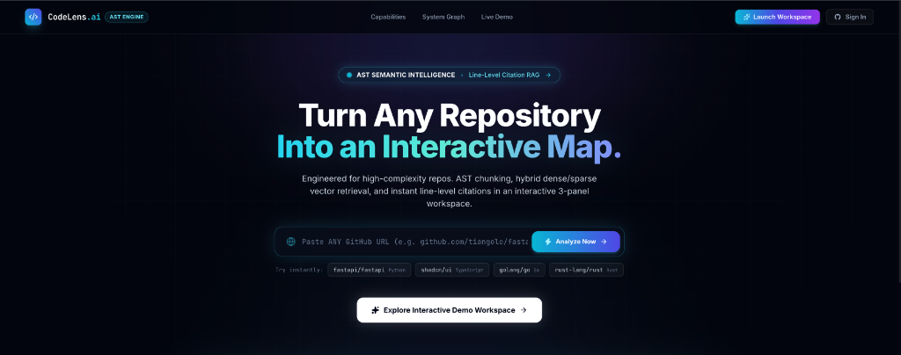
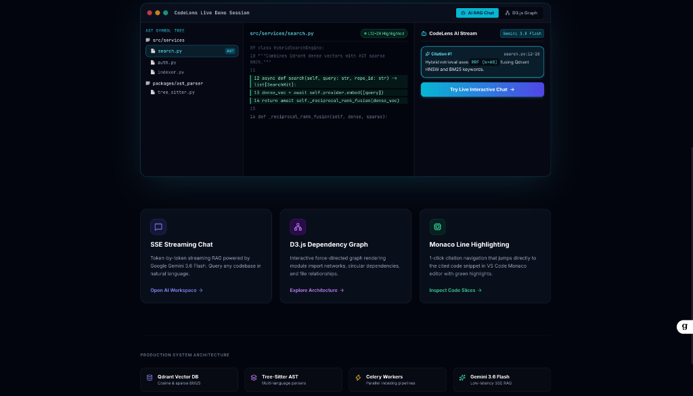
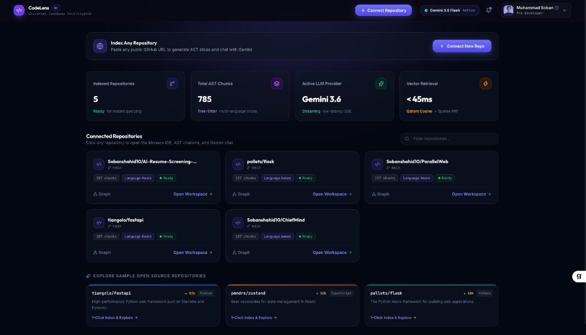
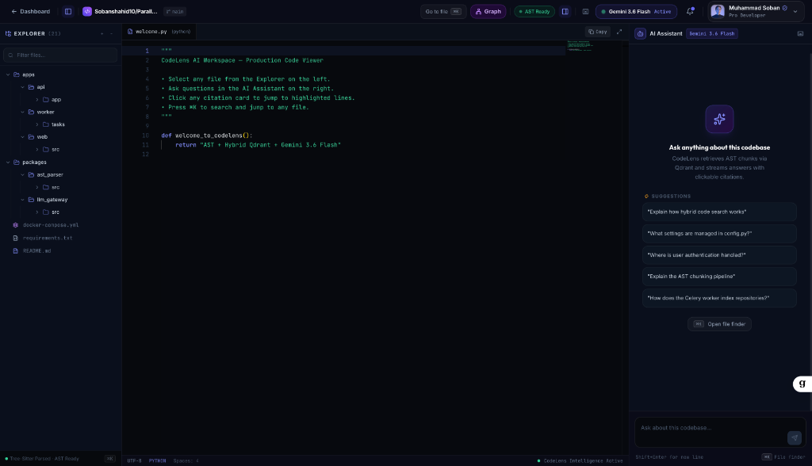

<div align="center">

# 🔍 CodeLens

**Enterprise-Grade AI Codebase Intelligence & Visual Debugging Platform**

[](https://www.typescriptlang.org/)
[](https://reactjs.org/)
[](https://www.python.org/)
[](https://fastapi.tiangolo.com/)
[](https://qdrant.tech/)
[](https://www.docker.com/)
[](https://deepmind.google/technologies/gemini/)
[](LICENSE)

<p align="center">
  <b>Turn any multi-thousand file repository into an interactive intelligence workspace. AST-aware chunking, hybrid dense/sparse vector retrieval, line-level streaming citations, and a force-directed D3.js dependency graph — all in one 3-panel Monaco editor workspace.</b>
</p>

<p align="center">
  <a href="#-overview">Overview</a> •
  <a href="#-key-features">Features</a> •
  <a href="#-system-architecture">Architecture</a> •
  <a href="#-getting-started">Getting Started</a> •
  <a href="#-technology-stack">Tech Stack</a> •
  <a href="#-author--developer">Author</a>
</p>

---

<a href="docs/screenshots/01-landing-page.png" title="🔍 CodeLens Landing Page — Click to view full resolution">
  
</a>
<br/><sub><b>Landing Page</b> — AST semantic intelligence banner with one-click GitHub repository ingestion and interactive demo launcher.</sub>

<br/><br/>

<table>
  <tr>
    <td width="33%" align="center">
      <a href="docs/screenshots/02-features-preview.png" title="🔍 Feature Highlights — Click to expand full resolution">
        
      </a>
      <br/><sub><b>Feature Highlights</b> — Interactive 3-panel preview, SSE streaming chat, and D3.js dependency graph.</sub>
    </td>
    <td width="33%" align="center">
      <a href="docs/screenshots/03-dashboard.png" title="🔍 Repository Dashboard — Click to expand full resolution">
        
      </a>
      <br/><sub><b>Repository Dashboard</b> — Multi-repo management, vector retrieval latency, and AST chunk counters.</sub>
    </td>
    <td width="33%" align="center">
      <a href="docs/screenshots/04-workspace.png" title="🔍 Monaco AI Workspace — Click to expand full resolution">
        
      </a>
      <br/><sub><b>AI Workspace</b> — 3-panel Monaco editor with live AST symbol tree, Gemini chat, and line-level citations.</sub>
    </td>
  </tr>
</table>

</div>

---

## 📑 Table of Contents

- [🔍 Overview](#-overview)
- [✨ Key Features](#-key-features)
- [🏗️ System Architecture](#-system-architecture)
- [🛠️ Technology Stack](#-technology-stack)
- [🚀 Getting Started](#-getting-started)
- [🧪 Frontend Quality Assurance & Testing Suite](#-frontend-quality-assurance--testing-suite)
- [🔧 Backend & Infrastructure Operations](#-backend--infrastructure-operations)
- [🔐 Environment Configuration](#-environment-configuration)
- [📁 Project Directory Structure](#-project-directory-structure)
- [👨‍💻 Author & Developer](#-author--developer)
- [📄 License](#-license)

---

## 🔍 Overview

Modern codebases are vast, deeply interconnected systems where tracing a single logic path can consume hours of a senior engineer's time. Understanding how a function propagates state, which modules depend on which, or what a particular class is responsible for requires context that spans thousands of files simultaneously.

**CodeLens** is a production-grade codebase intelligence platform that solves this by:

1. **Indexing Entire Repositories with AST Precision**: Parsing multi-language source files using Tree-Sitter grammars to extract function, class, and module boundaries — not arbitrary token windows.
2. **Enabling Natural Language Code Queries**: Hybrid dense + sparse vector retrieval (Reciprocal Rank Fusion, k=60) retrieves the most semantically and lexically relevant code chunks for any question.
3. **Streaming Answers with Line-Level Citations**: Gemini-powered SSE streaming delivers concise, accurate answers with clickable citations that jump directly to the highlighted line in Monaco Editor.
4. **Visualizing Module Dependency Topology**: A D3.js force-directed graph renders import networks, circular dependencies, and call graphs in real time.
5. **Operating at Production Scale**: 9-service Docker infrastructure with Celery workers, Redis, PostgreSQL RLS, Prometheus, and Grafana observability — ready for enterprise deployment.

---

## ✨ Key Features

| Feature | Description |
| :--- | :--- |
| 🌳 **AST-Aware Semantic Parsing** | Multi-language AST chunking via Tree-Sitter (8+ grammars) preserves function, class, and interface boundaries instead of arbitrary token cuts. |
| ⚡ **Hybrid Dense + Sparse Retrieval (RRF)** | Combines Qdrant HNSW dense semantic embeddings with BM25 sparse keyword vectors via Reciprocal Rank Fusion (k=60) for superior chunk ranking. |
| 💬 **SSE Streaming RAG Chat** | Token-by-token streaming conversational assistant with real-time answer delivery and clickable line-level code citations powered by Gemini 3.6 Flash. |
| 📊 **D3.js Force-Directed Dependency Graph** | Interactive topology viewer rendering call graphs, module dependencies, and import structures with zoom, pan, and cluster isolation. |
| 💻 **3-Panel Monaco Editor Workspace** | VS Code-powered Monaco editor with live AST symbol tree, file explorer, and AI chat assistant panel side-by-side. |
| 🔒 **PostgreSQL Row-Level Security (RLS)** | Engine-enforced multi-tenant isolation at the database level — no cross-user data leakage, ever. |
| 🔴 **Redis Sliding-Window Rate Limiting** | Per-user API rate limiting with configurable windows to protect LLM endpoints in production. |
| 📈 **Native Observability Suite** | Prometheus metrics collection with pre-configured Grafana dashboards for job queue health, RAG latency histograms, and token usage telemetry. |
| 🤖 **Swappable LLM Strategy** | Pluggable LLM gateway supports OpenAI, Anthropic Claude, and Google Gemini — switch providers via a single env variable. |
| 🏗️ **Production Docker Infrastructure** | 9-service Docker Compose stack with health checks, dependency ordering, Celery workers, Flower monitoring, and dev/prod environment separation. |

---

## 🏗️ System Architecture

```
                       ┌──────────────────────────────────────────────┐
                       │           React 18 + Vite Frontend           │
                       │  ├─ 3-Panel Workspace (Tree | Monaco | Chat)  │
                       │  ├─ D3.js Force-Directed Dependency Graph    │
                       │  ├─ Live WebSocket Indexing Progress         │
                       │  └─ SSE Streaming Chat with Citation Cards   │
                       └──────────────────────┬───────────────────────┘
                                              │ HTTPS / WS / SSE
                                              ▼
                       ┌──────────────────────────────────────────────┐
                       │            FastAPI Async Gateway             │
                       │  ├─ GitHub OAuth + JWT Auth (7-day tokens)   │
                       │  ├─ PostgreSQL RLS Tenant Injection          │
                       │  └─ Redis Sliding-Window Rate Limiter        │
                       └──────────────┬───────────────┬───────────────┘
                                      │               │
            ┌─────────────────────────┘               └────────────────────────┐
            ▼                                                                  ▼
┌───────────────────────┐                                         ┌───────────────────────┐
│     PostgreSQL 16     │                                         │   Celery Worker Pool  │
│  (pgvector + RLS)     │                                         │  ├─ Repository Clone  │
└───────────────────────┘                                         │  ├─ AST Parallel Parse│
            ▲                                                     │  └─ Embed & Qdrant    │
            │                                                     └───────────┬───────────┘
┌───────────────────────┐                                                     │
│   Redis 7 (LRU 512MB) │                                                     │
└───────────────────────┘                                                     ▼
                                                                  ┌───────────────────────┐
                                                                  │     Qdrant Vector DB  │
                                                                  │ (HNSW Dense + BM25)   │
                                                                  └───────────────────────┘
```

---

## 🛠️ Technology Stack

| Domain | Technology / Library | Description |
|---|---|---|
| **Frontend Platform** | React 18, Vite 6, TypeScript 5 | Lightning-fast HMR & build environment |
| **Styling & State** | TailwindCSS 3, Zustand 5, TanStack Query v5 | Responsive UI tokens and unified store management |
| **Editor & Graph** | `@monaco-editor/react`, D3.js v7, Lucide React | VS Code editing engine & force-directed visualization |
| **API Gateway** | Python 3.12, FastAPI, AsyncPG, Pydantic v2 | High-concurrency async HTTP/WS backend |
| **Vector Engine & RAG** | Qdrant v1.13, Tree-Sitter, Gemini / OpenAI / Anthropic | Dense HNSW + Sparse BM25 hybrid search |
| **Task Queue & Cache** | Celery 5, Redis 7, Flower | Distributed asynchronous worker processing |
| **Persistence & Security** | PostgreSQL 16 (`pgvector` + RLS), JWT Auth | Engine-level tenant isolation & vector storage |
| **Monitoring & QA** | Prometheus 2.52, Grafana 11, Pytest | Production metrics telemetry & health monitoring |

---

## 🚀 Getting Started

### Prerequisites

Ensure the following tools are installed locally:
- **Node.js**: >= 18.0.0 (LTS recommended)
- **npm**: >= 9.0.0
- **Docker & Docker Compose**: Docker Engine >= 24.0
- **Python**: >= 3.12 (for backend services)

---

### Quick Start (Local Docker Infrastructure)

1. **Clone the repository**:
   ```bash
   git clone https://github.com/Sobanshahid10/CodeLens.git
   cd CodeLens
   ```

2. **Configure Environment Variables**:
   ```bash
   cp .env.example .env
   # Edit .env and fill in your API keys (Gemini, GitHub OAuth, etc.)
   ```

3. **Spin up all 9 Docker microservices**:
   ```bash
   make dev
   ```

4. **Run database migrations**:
   ```bash
   make migrate
   ```

5. **Start the frontend**:
   ```bash
   cd apps/web
   npm install
   npm run dev
   # → http://localhost:3000
   ```

---

### Running the Web Application (Frontend Only)

```bash
# Navigate to web application directory
cd apps/web

# Install dependencies
npm install

# Start local Vite dev server (http://localhost:3000)
npm run dev
```

Available scripts in `apps/web/package.json`:
- `npm run dev` — Launches Vite dev server with backend API proxy (`http://localhost:8000`).
- `npm run build` — Runs TypeScript compiler (`tsc --noEmit`) and creates production build.
- `npm run preview` — Serves local production build on `http://localhost:4173`.
- `bash test_frontend.sh` — Executes the complete 10-gate frontend QA test suite.

---

## 🧪 Frontend Quality Assurance & Testing Suite

CodeLens features a custom **10-Gate Automated Frontend QA Engine** located at [`apps/web/test_frontend.sh`](apps/web/test_frontend.sh). It validates type safety, source audits, store state logic, routing integrity, API reachability, and browser rendering.

### Running the Frontend Test Suite

```bash
cd apps/web

# Full execution (includes npm install & background browser check)
./test_frontend.sh

# Fast execution (skips npm install & browser spawn)
./test_frontend.sh --skip-browser --skip-install
```

### Breakdown of the 10 Quality Gates

| Gate | Name | Description & Verification Standard |
|:---:|---|---|
| **1** | **Dependency Integrity** | Verifies presence of `node_modules` and required core libraries (`react`, `@tanstack/react-query`, `zustand`, `@monaco-editor/react`, `d3`, `lucide-react`). |
| **2** | **TypeScript Type-Check** | Runs `npx tsc --noEmit` across all `.ts` and `.tsx` source files to guarantee zero type errors. |
| **3** | **Production Build** | Executes `vite build` to verify clean production compilation and distribution output. |
| **4** | **Bundle Size Analysis** | Measures JavaScript chunk sizes, issuing warnings if any single chunk exceeds 500 KB. |
| **5** | **Source File Audit** | Scans for stray `console.log` statements, unresolved `TODO`/`FIXME` tags, and verifies explicit named exports. |
| **6** | **Route Coverage Check** | Audits route declarations (`/login`, `/dashboard`, `/repo/:repoId`, `/repo/:repoId/graph`, `/auth/callback`) in `App.tsx`. |
| **7** | **Store & Hook Logic** | Runs inline Node.js unit-smoke tests for Zustand Toast & Auth stores, API URL builders, and route redirection logic (**16/16 passed**). |
| **8** | **API Network Test** | Tests backend HTTP reachability at `http://localhost:8000/health` and `/api/v1/auth/demo`. |
| **9** | **Environment Audit** | Compares key definitions between `.env` and `.env.example`. |
| **10** | **Browser Live Verification** | Launches background dev server on port `3000`, checking HTTP 200 responses and DOM `#root` mount point. |

---

## 🔧 Backend & Infrastructure Operations

Execute operations using root `Makefile` shortcuts:

```bash
make up       # Launch all 9 Docker containers in background
make dev      # Launch dev environment with streaming service logs
make down     # Terminate all containers and purge volumes
make migrate  # Apply Alembic schema migrations
make lint     # Execute Ruff linter and MyPy static type analyzer
make test     # Execute Pytest test suite with coverage
make eval     # Execute RAGAS ground-truth evaluation pipeline
```

---

## 🔐 Environment Configuration

Key configuration parameters in `.env`:

| Key | Purpose | Default / Format |
|---|---|---|
| `POSTGRES_PASSWORD` | PostgreSQL superuser password | `codelens_dev_pass` |
| `REDIS_PASSWORD` | Redis authentication password | `redis_dev_pass` |
| `QDRANT_API_KEY` | Vector DB security key | `qdrant_dev_key` |
| `JWT_SECRET` | Signing key for authorization tokens | `super-secret-jwt-key` |
| `GITHUB_CLIENT_ID` | OAuth application ID | `your_github_client_id` |
| `GITHUB_CLIENT_SECRET` | OAuth application secret | `your_github_client_secret` |
| `LLM_PROVIDER` | Swappable LLM strategy (`openai`, `anthropic`, `gemini`) | `gemini` |
| `GEMINI_API_KEY` | Google Gemini API key | `your_gemini_api_key` |
| `OPENAI_API_KEY` | OpenAI secret API key (optional) | `sk-...` |

---

## 📁 Project Directory Structure

```
CodeLens/
├── apps/
│   ├── api/                  # FastAPI Web Gateway, Controllers & Middleware
│   ├── eval/                 # RAGAS Ground-Truth Evaluation Suite
│   ├── web/                  # React 18 + Vite Web Application
│   │   ├── src/
│   │   │   ├── components/   # ChatPanel, CodeViewer, DependencyGraph, FileTree, etc.
│   │   │   ├── hooks/        # Custom React Hooks (useSSEChat, useToast, etc.)
│   │   │   ├── lib/          # API Client, Auth, SSE Event Stream Listeners
│   │   │   ├── pages/        # Dashboard, Workspace, Graph, Login, AuthCallback
│   │   │   └── stores/       # Zustand State Stores (authStore, repoStore, palette)
│   │   └── test_frontend.sh  # 10-Gate Automated Frontend QA Script
│   └── worker/               # Celery Asynchronous Background Task Queue
├── packages/
│   ├── ast_parser/           # Tree-sitter Multi-Language Code Parsing Engine
│   ├── core/                 # Shared Data Models, ORM Schemas, DB Utilities
│   └── llm_gateway/          # Swappable Strategy Client for OpenAI/Anthropic/Gemini
├── infra/
│   ├── docker/               # Microservice Dockerfiles (API, Worker, Postgres)
│   ├── grafana/              # Telemetry Dashboards & Provisioning
│   └── prometheus/           # Prometheus Telemetry Collector Configuration
├── docs/
│   └── screenshots/          # UI showcase screenshots
├── docker-compose.yml        # 9-Service Infrastructure Manifest
├── docker-compose.dev.yml    # Local Development Override Configuration
├── Makefile                  # Operational Command Shortcuts
└── README.md                 # Project Documentation
```

---

## 👨‍💻 Author & Developer

<div align="center">


**Muhammad Soban**

[](https://github.com/Sobanshahid10)
[](https://www.linkedin.com/in/muhammadsoban10)

*Building high-performance, production-grade AI and developer tooling systems.*

</div>

---

## 📄 License

This repository is licensed under the [MIT License](LICENSE).

---

<div align="center">
  <sub>CodeLens • Developed by <b><a href="https://github.com/Sobanshahid10">Muhammad Soban</a></b> • Built with ❤️ for engineers who demand deep codebase intelligence at production scale.</sub>
</div>
